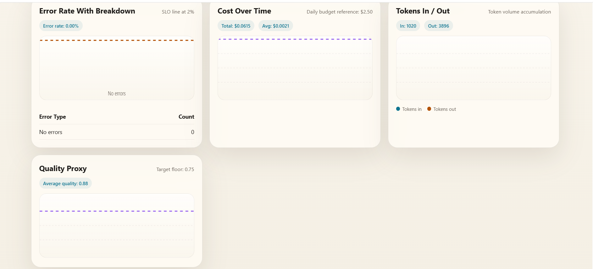

# Day 13 Observability Lab Report

## 1. Team Metadata
- GROUP_NAME: Lab13-Observability-Team
- REPO_URL: https://github.com/VinUni-AIThucChien/Lab13-Observability
- MEMBERS:
  - Member A: Nguyễn Bằng Anh - 2A202600136 | Role: dashboard + evidence + blueprint + demo lead
  - Member B: Đỗ Thị Thùy Trang - 2A202600041 | Role: SLO + alerts
  - Member C: Nguyễn Thị Thanh Huyền - 2A202600211 | Role: tracing + tags
  - Member D: Nguyễn Quốc Nam - 2A202600201 | Role: logging + PII
  - Member E: Bùi Trọng Anh - 2A202600010 | Role: load test + incident injection

---

## 2. Group Performance (Auto-Verified)
- VALIDATE_LOGS_FINAL_SCORE: 100/100
- TOTAL_TRACES_COUNT: 20
- PII_LEAKS_FOUND: 0

---

## 3. Technical Evidence (Group)

### 3.1 Logging & Tracing
- EVIDENCE_CORRELATION_ID_SCREENSHOT: 
- EVIDENCE_PII_REDACTION_SCREENSHOT: 
- EVIDENCE_TRACE_WATERFALL_SCREENSHOT: 
- TRACE_WATERFALL_EXPLANATION: Span `rag_retrieval` cho thấy thời gian tìm kiếm ở vector DB (thường rất nhanh), sau đó là span `llm_generate` chiếm đến hơn 80% tổng thời lượng trace, cho thấy nút thắt cổ chai (bottleneck) chính của hệ thống nằm ở việc chờ phản hồi từ LLM.

### 3.2 Dashboard & SLOs
- DASHBOARD_6_PANELS_SCREENSHOT: 
- SLO_TABLE:
| SLI | Target | Window | Current Value |
|---|---:|---|---:|
| Latency P95 | < 3000ms | 28d | **1556.4ms** |
| Error Rate | < 2% | 28d | **0.00%** |
| Cost Budget | < $2.5/day | 1d | **$0.0615** |

### 3.3 Alerts & Runbook
- ALERT_RULES_SCREENSHOT: 
- SAMPLE_RUNBOOK_LINK: [Runbook xử lý High Latency P95 (alerts.md#L3-L14)](./alerts.md#L3-L14)

---

## 4. Incident Response (Group)
- SCENARIO_NAME: rag_slow
- SYMPTOMS_OBSERVED: P95 latency spikes heavily from ~1000ms to > 10000ms. End-users experience long waits for responses.
- ROOT_CAUSE_PROVED_BY: In Langfuse traces, the `rag_retrieval` span takes > 10000ms compared to the baseline < 500ms. Alert rules trigger for `HighLatency`.
- FIX_ACTION: Investigate the RAG retrieval service, ensure database indexes are optimized, and increase timeout constraints or implement a circuit breaker. Disable the incident using `scripts/inject_incident.py --scenario rag_slow --disable`.
- PREVENTIVE_MEASURE: Implement stricter timeouts for downstream services and provide fallback caching mechanisms.

---

## 5. Individual Contributions & Evidence

### Nguyễn Bằng Anh - 2A202600136
- TASKS_COMPLETED: Created the blueprint report, set up the initial repository, generated dashboard specification, and orchestrated demo.
- EVIDENCE_LINK: [Điền link PR/commit của bạn vào đây]

### Đỗ Thị Thùy Trang - 2A202600041
- TASKS_COMPLETED: Configured `alert_rules.yaml` and documented the alert runbooks in `alerts.md`.
- EVIDENCE_LINK: [Điền link PR/commit của Thùy Trang vào đây]

### Nguyễn Thị Thanh Huyền - 2A202600211
- TASKS_COMPLETED: Added log enrichment in `main.py` and validated traces in Langfuse.
- EVIDENCE_LINK: [Điền link PR/commit của Thanh Huyền vào đây]

### Nguyễn Quốc Nam - 2A202600201
- TASKS_COMPLETED: Implemented Correlation ID Middleware and added regex patterns for PII scrubbing.
- EVIDENCE_LINK: [Điền link PR/commit của Quốc Nam vào đây]

### Bùi Trọng Anh - 2A202600010
- TASKS_COMPLETED: Executed load testing with multiple concurrency levels, generated traffic for traces and metrics, built the 6-panel dashboard from exported metrics, prepared dashboard evidence for the report, and supported incident injection and demo verification.
- EVIDENCE_LINK: [Điền link PR/commit của Trọng Anh vào đây]

---

## 6. Bonus Items (Optional)
- BONUS_COST_OPTIMIZATION: (Description + Evidence)
- BONUS_AUDIT_LOGS: (Description + Evidence)
- BONUS_CUSTOM_METRIC: (Description + Evidence)
